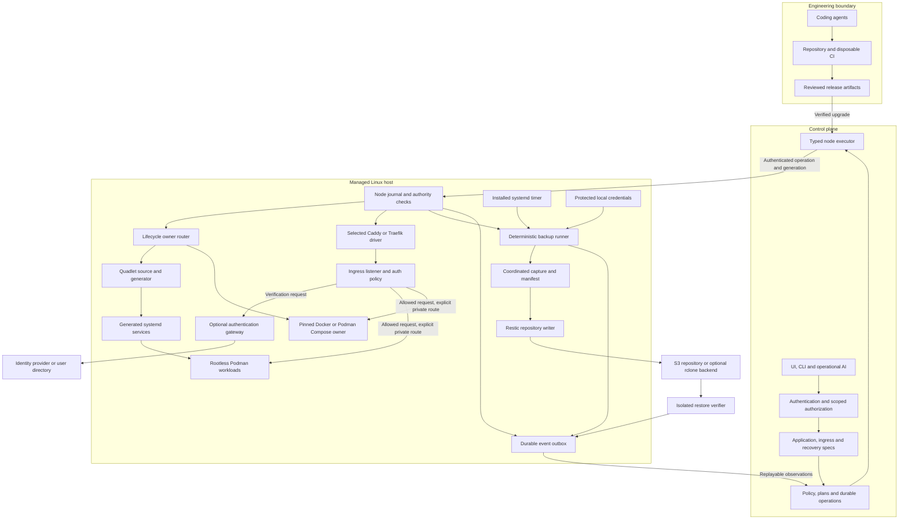

# SPEC.md — Podman/Quadlet-first Coolify Fork with Policy-Based Automation

> **Working title:** Coolify Podman Fork (rename before public distribution)
>
> **Status:** Normative design draft; implementation and production readiness remain unverified
>
> **Revision:** 2026-09-28 — runtime/recovery contracts, Caddy authentication, and evaluated agent harnesses
>
> **Document date:** 2026-09-28
>
> **Upstream:** `coollabsio/coolify` (Apache-2.0). The fork bootstrap process MUST record the exact upstream commit SHA used as its base.
>
> **Primary implementation objective:** Preserve the useful Coolify control-plane/user experience while introducing a runtime abstraction whose preferred Linux backend is Podman + systemd Quadlet, with production-grade database and filesystem backups using Restic, optional rclone transport, and S3-compatible object storage.

---

## 1. Normative language

The keywords **MUST**, **MUST NOT**, **REQUIRED**, **SHOULD**, **SHOULD NOT**, and **MAY** are normative requirements. Where this document conflicts with an implementation shortcut, this document wins unless the specification is deliberately amended in a reviewed change.

A feature is not considered complete because code exists, a unit test passes, or the UI renders. A feature is complete only when its applicable **Definition of Done (DoD)** is satisfied.

---

## 2. Product vision

Build a self-hosted PaaS that retains the best parts of Coolify—projects, environments, Git deployments, databases, services, domains, TLS, team access, API automation, and a polished control plane—while making Linux-native, daemonless container operations a first-class architecture.

The target platform SHOULD feel like “Coolify, but Podman/systemd-native and recovery-first.” The intended mature deployment model is:

- **Podman** as the preferred OCI runtime.
- **Quadlet** as the preferred declarative workload representation and systemd integration.
- **Docker** retained as a compatibility runtime while the fork evolves, unless a future major release explicitly removes it.
- **Compose** accepted as an import/compatibility format; Compose is not the canonical internal desired-state representation.
- **Rootless workloads by default** where technically appropriate.
- **systemd** responsible for process lifecycle and host-local schedules.
- **Restic** responsible for encrypted, deduplicated snapshot repositories.
- **Direct S3-compatible Restic repositories** as the default object-storage path.
- **rclone** as an optional compatibility transport for providers/protocols Restic does not natively cover well.
- **Engine-aware database dumps/snapshots** before Restic ingestion; raw filesystem copies of a live database are never presented as equivalent to a database-consistent backup.
- **Restore verification** treated as part of backup correctness.
- **Caddy and Traefik** as selectable ingress drivers, with explicit application access policies.
- **Policy-authorized automation** for maintenance, backups and restore drills, with no per-run approval for operations already covered by a valid standing policy.
- **Strong automation APIs** designed for both humans and AI agents without granting an LLM unrestricted root shell access.

---

## 3. Product goals

### G1 — Runtime independence

The Coolify control plane MUST stop assuming that every server operation is a Docker operation. Runtime-specific behavior MUST be behind explicit interfaces/adapters.

### G2 — Podman as a first-class runtime

A server MUST be able to be registered as a Podman server and support application, service, database, network, volume, image, health, logs, restart, redeploy, and deletion workflows without a Docker daemon.

### G3 — Quadlet as canonical Podman deployment output

The control plane MUST be able to compile its internal application model into deterministic Quadlet units. Re-running reconciliation with unchanged desired state MUST produce semantically identical units and MUST NOT cause unnecessary restarts.

### G4 — Compose compatibility without architecture capture

Users MUST be able to deploy existing Compose workloads. The platform SHOULD import Compose into an internal application specification and render Quadlets where possible. A direct `podman compose` / `podman-compose` compatibility mode MUST have its own pinned provider, capability matrix and lifecycle contract before being advertised as supported. It MAY ship after native deployment and import support. Unsupported semantics MUST be surfaced explicitly rather than silently ignored.

### G5 — Recovery-first data management

Every persistent data surface managed by the platform MUST have an explicit backup story, restore story, retention story, and observable execution history.

### G6 — Database-consistent backups

Supported databases MUST use database-engine-aware backup mechanisms. Restic stores the resulting artifacts; it does not replace database consistency semantics.

### G7 — Host-local reliability

Running workloads and scheduled backups MUST continue to function if the web control plane is temporarily unavailable. systemd services/timers SHOULD own runtime lifecycle and backup schedules once deployed to the host.

### G8 — Security by constrained capability

The control plane and future AI integrations MUST use constrained operations, least-privilege credentials, typed arguments, and explicit approval boundaries. No design SHOULD depend on handing an AI agent a permanent unrestricted `root@production` shell.

### G9 — Incremental forkability

The project MUST be implementable as an incremental fork rather than requiring a ground-up rewrite before value is delivered. Existing Coolify flows SHOULD continue to work while runtime abstractions are introduced.

### G10 — Agent-friendly engineering

The repository MUST be structured so a capable coding agent can receive a single goal, discover only the relevant context, implement it, verify it, and report whether the feature-level DoD is satisfied.

---

## 4. Non-goals for the first production release

The following are explicitly out of scope unless promoted by a later spec revision:

- Replacing systemd with a custom scheduler.
- Kubernetes compatibility or becoming a Kubernetes distribution.
- Multi-region distributed scheduling comparable to Nomad/Kubernetes.
- Windows hosts as workload servers.
- macOS hosts as production workload servers.
- Building a new object storage system.
- Using AI reasoning as the primary scheduler for deterministic recurring tasks.
- Pretending `podman-compose` is a perfect semantic replacement for Docker Compose.
- Guaranteed zero-downtime migration for every possible Docker Compose application.
- Treating “backup command exited 0” as sufficient evidence that recovery works.

---

## 5. Fork, license, and upstream strategy

Coolify currently declares Apache-2.0 licensing. The fork MUST preserve required notices and attribution, MUST keep a copy of the applicable license, and SHOULD adopt a distinct project name and visual identity before public distribution. Apache-2.0 does not grant a right to use upstream trademarks as the fork’s own brand.

The repository MUST contain an `UPSTREAM.md` file after bootstrap with at least:

```yaml
upstream_repository: https://github.com/coollabsio/coolify
fork_base_commit: <exact-sha>
fork_base_date: <yyyy-mm-dd>
license: Apache-2.0
upstream_tracking_branch: main
last_upstream_sync_commit: <sha>
```

The fork SHOULD preserve upstream-compatible domain concepts where doing so lowers maintenance cost, but MUST NOT retain Docker-specific architecture merely to minimize diff size.

### Reuse provenance

Any imported Dokploy implementation MUST record the exact source commit, file paths, license and notices. Its inspected license separates content under `/proprietary` from general Apache-2.0 coverage; ordinary code reuse MUST exclude separately restricted content unless appropriately authorized. Product ideas MAY be implemented independently. The applicable license at the actual reused commit governs. See §32.

The bootstrap inventory MUST cover deployment, status, logs/terminal, cleanup, database actions, proxy configuration, service templates, metrics, installation and self-upgrade. First-release control-plane packaging MAY remain Docker-based while workload hosts operate without Docker; the UI and installation guide MUST state this distinction.

### Upstream-sync rule

Upstream synchronization MUST be deliberate. Changes SHOULD be categorized as:

1. **Cleanly inherited** — unaffected upstream code.
2. **Adapted** — upstream functionality routed through the runtime/storage abstraction.
3. **Fork-owned** — functionality intentionally diverged, with a local design note explaining why.

Agents MUST NOT resolve upstream merge conflicts by deleting fork-specific runtime abstractions simply to make a merge pass.

---

## 6. Baseline upstream architecture to preserve or refactor

At the time of this specification, Coolify is a Laravel/Livewire application that manages servers over SSH, uses jobs/actions/services for deployments and infrastructure operations, exposes an API, and uses Traefik for per-server proxying. The fork SHOULD preserve stable user/domain concepts while extracting runtime-specific behavior.

Important inherited concepts include:

- Team → Project → Environment → Resource hierarchy.
- `Server`, `Application`, `Service`, standalone database resources, proxy configuration, secrets/environment variables, deployment history, jobs, and notifications.
- Laravel authorization/policies and the existing API surface where compatibility is useful.
- Existing Git provider and build-pack integrations where they can produce standard OCI images.

The following assumptions MUST be progressively removed from core domain logic:

- Docker is the only runtime.
- Docker socket semantics are available everywhere.
- Docker Compose is the only multi-container desired-state representation.
- host scheduling depends on the central application being online.
- persistent storage implies it is backed up.

---

## 7. Architectural principles

### 7.1 Internal desired state before runtime syntax

The platform MUST have an internal resource model independent of Docker Compose, Quadlet, or a specific CLI command. Call this model `ApplicationSpec` in this document.

Conceptually:

```text
Git / image / Compose / UI settings
              |
              v
       normalized ApplicationSpec
              |
       +------+------+----------------+
       |             |                |
       v             v                v
Docker driver   Podman driver   future runtime
                     |
                     v
               Quadlet compiler
```

### 7.2 Declarative and idempotent

Operations SHOULD converge desired state rather than execute blind imperative scripts. Generated runtime artifacts MUST be reproducible from persisted desired state.

### 7.3 Host-local ownership

Once deployed, systemd SHOULD own service restart behavior, ordering, and timers. The control plane owns desired state, orchestration, visibility, and policy.

### 7.4 Explicit capabilities

A server records capabilities such as:

```text
runtime.podman
runtime.docker
systemd.quadlet
systemd.user_units
build.buildah
compose.podman_provider
backup.restic
backup.rclone
storage.s3
network.rootless
network.privileged_ports
```

The UI/API MUST use capability discovery rather than guessing from distribution names.

### 7.5 Typed remote operations

Remote execution SHOULD migrate from interpolated shell strings toward typed operations. If SSH remains the transport, command construction MUST use validated structured arguments and robust escaping. A restricted host executor MUST enforce operation scope from the first supported remote mutation. A resident host agent MAY replace the SSH transport later. Raw units, hooks, mount paths and command arrays are not safe merely because they are typed; the executor MUST enforce their authority under the assigned runtime identity. Transport fallback MUST NOT bypass a policy denial.

### 7.6 Fail closed on semantic loss

Importers and converters MUST NOT silently drop behavior. If a Compose key cannot be represented safely, preflight MUST return a specific diagnostic and remediation path.

### 7.7 Recovery is a feature, not a side effect

A backup feature is incomplete without restore, verification, error visibility, retention, and documentation.

---

## 8. Target architecture

The following diagram separates engineering agents from production operations and shows the native and compatibility lifecycle owners. Arrows indicate requests or artifact/data flow, not equivalent privileges. The node executor resolves each operation to a runtime identity; backup credentials, workload identities and privileged bootstrap operations MUST remain separately scoped.



The standalone source is `ARCHITECTURE_Coolify-Podman.mmd`. In the repository it SHOULD be placed at `docs/architecture/system.mmd` with this reference updated. A selected ingress instance owns a defined listener set; the diagram does not instruct both proxies to bind the same ports. Forward authentication grants access to a route; it does not confer control-plane RBAC or host privileges.

---

## 9. Core domain abstractions

The names below are conceptual; implementations MAY use different names if the boundaries remain equivalent.

### 9.1 `RuntimeDriver`

Required behavior:

```text
probeCapabilities(server)
preflight(spec)
plan(spec, observedState)
apply(plan)
inspect(resource)
start(resource)
stop(resource)
restart(resource)
remove(resource)
streamLogs(resource)
exec(resource, typedCommand)
listNetworks()
listVolumes()
reconcile(resource)
```

Implementations:

- `DockerRuntimeDriver` — wraps inherited Docker behavior.
- `PodmanRuntimeDriver` — preferred new runtime.

Runtime-independent domain services MUST NOT invoke `docker ...` or `podman ...` directly.

### 9.2 `ApplicationSpec`

At minimum represents:

- source/build definition;
- OCI image reference or build output;
- containers/processes;
- command/entrypoint;
- environment and secret references;
- health checks;
- resources/limits;
- networks;
- ports/exposure;
- persistent mounts;
- dependencies/ordering;
- restart policy;
- update strategy;
- ingress metadata;
- labels/metadata;
- runtime extension fields where unavoidable.

The spec MUST be versioned. Migrations between spec versions MUST be deterministic and testable.

### 9.3 `QuadletCompiler`

Input: normalized `ApplicationSpec` plus server capabilities.

Output: a deterministic set of Quadlet files and systemd metadata.

The compiler MUST:

- produce stable ordering and formatting;
- validate names and paths;
- avoid embedding plaintext secret values when an environment/credential file can be referenced securely;
- support `.container`, `.pod`, `.network`, `.volume`, `.image`, and `.build` where appropriate;
- preserve dependency relationships with systemd semantics;
- expose unsupported configuration as diagnostics;
- support dry-run rendering;
- support diffing desired units against installed units;
- stage and publish complete versioned bundles, journal activation, and perform safe compensating recovery; file publication MUST NOT be represented as transactional rollback of application data.

### 9.4 `NodeExecutor`

The control plane sees typed operations, not arbitrary shell by default.

Examples:

```text
podman.inspect(resourceId)
quadlet.render(spec)
quadlet.install(unitBundle)
systemd.reload()
systemd.start(unit)
systemd.status(unit)
backup.run(planId)
backup.check(repositoryId)
restore.stage(executionId)
fs.stat(path)
logs.tail(unit, cursor)
```

The initial implementation MAY use SSH to invoke the same restricted, typed node executor required by §7. Transport choice MUST NOT bypass its authorization, generation or journaling checks. A resident authenticated host agent is optional and MUST preserve the same operation contract.

### 9.5 `BackupRepository`

Represents a Restic repository plus transport and credential references.

Fields SHOULD include:

```text
id
name
backend_type: s3 | rclone | local-test
endpoint
bucket
prefix
region
credential_ref
restic_password_ref
provider_hint
capabilities
verification_policy
created_at
last_check_at
```

Secrets MUST NOT be returned through normal API serialization.

### 9.6 `BackupPlan`

Represents what is backed up and how.

```text
source_type: database | named_volume | bind_directory | control_plane
source_id
repository_id
schedule
consistency_mode
retention_policy
verification_policy
pre_hooks
post_hooks
enabled
```

### 9.7 `BackupExecution`

Must be durable and queryable with states such as:

```text
queued
preparing
quiescing
snapshotting
uploading
verifying
succeeded
failed
cancelled
```

Execution history MUST include timings, snapshot ID, bytes processed where available, verification result, and redacted error diagnostics.

### 9.8 `RestoreExecution`

Restore is its own durable workflow; it is not merely a button that launches a shell command. It MUST track source snapshot, target, validation, rollback/cleanup, and final status.

### 9.9 Runtime identity, releases and recovery groups

`RuntimeContext` MUST identify host, runtime, execution UID/GID, user/system manager, storage configuration, installed versions and capability fingerprint. Resource identity MUST include this context: host-level `runtime=podman` is insufficient when rootful and multiple rootless contexts coexist.

`Release` MUST record source revision, immutable image references, normalized spec and bundle hashes, compiler version, runtime context, secret-version references, migration classification, ingress generation and rollback-artifact retention. Recoverable activation states MUST include planned, staged, activating, committed, compensating, rolled_back and needs_intervention.

`RecoveryGroup` MUST link related database artifacts, volumes/binds, external assets, application release and configuration/secret references. It MUST declare whether consistency is coordinated, application-consistent, crash-consistent or best effort. Each recovery point MUST record source consistency time separately from capture/upload completion and verification time.

`NodeOperation` MUST include operation ID, idempotency key, target scope, expected resource generation, controller ownership epoch, policy version, deadline and durable outcome. A local journal/outbox MUST tolerate lost replies, duplicate delivery and reordered events. Reconnecting controllers MUST reconcile observed state before retrying effects.

`MaintenancePlan` MUST identify allowed runbooks, resource scope, preconditions, schedule/window, concurrency, verification, recovery, cost/resource limits and standing authorization. The model MAY propose a plan but MUST NOT grant itself authority.

## 10. Podman and Quadlet execution model

### 10.1 Supported deployment modes

The platform SHOULD expose four modes:

1. **Podman + Quadlet Native** — preferred.
2. **Compose Import → ApplicationSpec → Quadlet** — preferred migration path for Compose users.
3. **Podman Compose Compatibility** — direct `podman compose` with an explicit provider such as `podman-compose`; used when conversion is not yet supported.
4. **Docker Compatibility** — inherited Coolify behavior, routed through `DockerRuntimeDriver`.

The UI MUST clearly label compatibility modes and their limitations.

### 10.2 Why Quadlet is canonical

Podman documents Quadlet as its declarative systemd integration for containers, pods, volumes, networks, images, Kubernetes YAML, artifacts, and builds. By contrast, `podman compose` delegates to an external Compose provider. The architecture therefore treats Compose as input compatibility and Quadlet/systemd as the stable Podman runtime target.

### 10.3 Rootless model

The first production profile MUST state its trust boundary. A dedicated unprivileged account with user services and lingering is suitable for a trusted single-operator profile. A shared `paas` account MUST NOT be advertised as hostile multi-tenant isolation. Stronger separation requires separately scoped identities or hosts and tested access controls.

The product MUST detect and report whether the host supports the chosen rootless configuration.

The first supported ingress topology MUST be concrete and tested: a host-level proxy with narrowly granted listener privileges forwarding to explicitly allocated loopback ports, or a proxy in an appropriate shared rootless network context. Container loopback is not host loopback. Arbitrary project workloads MUST NOT reach management sockets, backup credentials or other projects' routes through this design.

Additional ingress modes MAY follow after separate tests. The platform MUST NOT silently switch workloads to rootful mode, weaken a host privileged-port setting, or assume rootful and rootless container networks are interchangeable. Caddy and Traefik must both conform to §13.

### 10.4 Unit location and ownership

Quadlet locations MUST be chosen explicitly for rootless/rootful mode. Ownership and permissions MUST be verified before activation. Generated files MUST include a stable platform ownership marker so the reconciler can distinguish platform-managed units from user-managed units.

### 10.5 Reconciliation and lifecycle ownership

Each resource MUST have exactly one lifecycle owner: Quadlet/systemd, pinned Podman Compose, or the declared Docker compatibility controller. Quadlet start/stop/restart requests MUST go through its owning systemd service. Direct runtime inspection and appropriately scoped exec are separate operations. Switching modes MUST be an explicit migration; fallback MUST NOT attach a second owner to the same containers.

The reconciler MUST render, compare effective configuration including referenced secret/config versions, validate with the target generator, stage, journal, publish, reload, activate and verify the selected release. No-op reconciliation MUST NOT restart a resource. A crash MUST leave a recoverable journal entry; deletion MUST use scoped ownership and tombstones. Stale controllers MUST be fenced by generation/ownership checks.

Quadlet input installation metadata governs generated-service boot activation; ordinary enabling of generated services MUST NOT be assumed. The supported host matrix MUST test cgroup v2, user-manager startup, subordinate IDs, delegation and security labels. Independent image auto-update controllers MUST be disabled unless integrated into the same release protocol.

A unit-bundle rollback MUST NOT claim to reverse database writes or incompatible schema changes. Recreate, parallel-release and stateful updates MUST declare downtime, writer ownership and safe rollback conditions. Rollback images and required compatible secret versions MUST be retained for the declared window. A failed compensation MUST become `needs_intervention`, not success.

---

## 11. Compose compatibility requirements

Compose support MUST use a compatibility matrix. For every supported key, the project MUST state one of:

- supported directly;
- translated;
- supported with documented limitation;
- unsupported with hard preflight error.

Priority semantics include:

- services;
- image/build;
- command/entrypoint;
- environment/env files;
- ports/expose;
- healthcheck;
- restart;
- named volumes;
- bind mounts;
- networks;
- depends_on / ordering;
- profiles;
- secrets/configs;
- resource limits;
- labels;
- pull/build policy.

Compose conversion MUST have golden tests that compare input YAML to normalized `ApplicationSpec` and expected Quadlets.

### 11.1 Source and provider contract

The importer MUST pin a supported Compose dialect/provider matrix and retain original input, source locations, resolution inputs and diagnostics. Fixtures MUST cover interpolation, escaped dollars, command/entrypoint forms, override merges, relative paths, profiles, external resources, network namespaces, bind addresses, port protocols and secret/config permissions. Unsupported includes or extensions that can execute or widen privileges MUST fail preflight.

Started, healthy and completed-successfully dependencies MUST have distinct implementations or explicit rejection. systemd ordering alone MUST NOT substitute for readiness. Golden rendering fixtures MUST be paired with runtime semantics tests for supported behavior, including failed migrations, dependency timeout and manual-stop/reboot semantics.

Compatibility mode MUST pin the provider executable and version, project identity, manifest, boot supervision and resource discovery. Provider availability MUST NOT silently choose a different implementation. Conversion failure MUST NOT automatically launch the original input through compatibility mode.

## 12. Build system

The fork SHOULD continue to support Git-backed application builds while producing standard OCI images.

A `BuildDriver` MUST be independent of `RuntimeDriver`. OCI output compatibility does not imply builder compatibility: Railpack’s documented frontend uses BuildKit. Prebuilt images are the first runtime slice; Containerfile builds follow, and additional builders require separate tests.

Build modes SHOULD include:

- Containerfile/Dockerfile via Buildah or `podman build`;
- prebuilt OCI image;
- inherited buildpacks (Railpack/Nixpacks/etc.) where they can produce an OCI artifact without depending on a Docker daemon;
- Quadlet `.build` only for explicitly supported cases; production application boot SHOULD use a retained image digest without rebuilding source.

Builds SHOULD run rootlessly where possible. Build secrets MUST use mechanisms that avoid committing credentials to image layers or logs.

The build pipeline MUST emit:

- immutable image digest;
- build log with secrets redacted;
- source revision;
- build configuration hash;
- SBOM/provenance hooks in the mature release.

---

Builds and untrusted preview branches MUST be isolated from production identities, management sockets and backup credentials. Registry retention MUST preserve running, pending and rollback releases. Build cancellation, stale deployment completion, cache/disk limits and registry outages MUST have explicit behavior.

## 13. Ingress, TLS and application authentication

### 13.1 Two supported proxy drivers

`ProxyDriver` MUST have Caddy and Traefik implementations with capability discovery, preflight, render, plan, apply, inspect, rollback and remove behavior. Caddy MUST be a first-class option, not a future placeholder. A release MUST publish which capabilities of each driver meet production gates.

Each `IngressInstance` MUST identify host/runtime identity, driver/version, module inventory, listener addresses, certificate-storage reference and selected config generation. Exactly one owner may bind a given address/protocol/port tuple. Different ingress instances MAY use different drivers on separate listeners or hosts. Migration between proxies MUST preflight routes, auth policies, certificates and traffic cutover; certificate files MUST NOT be assumed portable across implementations.

`IngressSpec` MUST model domain/path matchers, exposure, upstream resource references, health/readiness, HTTP/WebSocket behavior, TLS policy and an `AuthPolicy` reference. Native Podman routing MUST NOT depend on a Docker socket. Traefik SHOULD use explicit file-provider configuration; Caddy MUST compile to a deterministic Caddyfile and adapted native configuration.

### 13.2 Authentication contract

Authentication at ingress is distinct from application authorization and the control plane's own login/RBAC. Control-plane API tokens and agent identities MUST retain their native authorization even if an outer access layer protects the UI.

| AuthPolicy mode | Caddy implementation | Traefik implementation | Intended use |
| --- | --- | --- | --- |
| `public` | No auth handler | No auth middleware | Explicitly public route. |
| `basic` | `basic_auth` | BasicAuth middleware | Small private services over HTTPS; hashed credentials. |
| `forward` | `forward_auth` | ForwardAuth middleware | Gateway-managed login, sessions, MFA and route authorization. |
| `application` | Preserve application login | Preserve application login | App implements its own identity and authorization. |

Caddy's standard `basic_auth` uses password hashes, and `forward_auth` delegates a verification request to an external service. Neither constitutes a complete built-in OIDC identity provider. The initial tested gateway profile SHOULD use Authelia; additional gateways require a versioned adapter and test matrix. OIDC/SAML support is a gateway/IdP capability and MUST NOT be inferred from the proxy selection. Sources: C1–C4 in §32.

An `AuthPolicy` MUST define resource scope, mode, credential/gateway reference, permitted identity headers, route authorization responsibility, public exceptions, failure behavior and generation. `forward` profiles MUST declare verification endpoint, response/header mapping, trusted transport, timeout and browser/API response behavior. Missing or invalid policies MUST reject deployment. Verification denial, timeout, malformed response or unavailability MUST NOT pass traffic to the protected upstream. Preserving a working route after a rejected config update means retaining its previous protection, never falling back to public access.

Before authentication, the compiler MUST remove client-supplied identity headers that the application trusts. After verification, it MAY inject only allowlisted authoritative identity fields. This MUST apply even when a successful response omits a field. Forwarded host/protocol/client-IP handling MUST trust only the configured upstream proxy chain; arbitrary client headers MUST NOT determine authorization or redirect destinations. Protected application ports MUST be unreachable through an unauthenticated alternate public route.

The gateway login/callback routes MUST avoid self-authentication loops. Public health, callback and webhook exceptions MUST be exact, purpose-bound and tested; webhooks require their own authentication. Paths and encodings that could bypass matchers MUST be tested. Browser redirects and machine-client `401`/`403` behavior MUST be separate profiles. Basic Auth MUST NOT silently consume an Authorization header required by the application; choose an appropriate alternative and explicitly define credential forwarding/removal.

### 13.3 Caddyfile ownership and configuration lifecycle

Platform-managed mode is the default. Users edit typed routes/auth policies; the compiler owns the complete ingress configuration. The UI/API MUST offer a redacted Caddyfile preview, diagnostics, diff and export. Password hashes, tokens and identity data MUST be treated as sensitive. Any supported custom fragments MUST be schema-limited and incapable of redefining global admin settings, imports, listeners, filesystem access or authentication order.

Advanced full-Caddyfile ownership MAY be offered as a separate administrator mode. It MUST clearly disable unsupported UI reconciliation guarantees and pass the same validation, authorization and generation checks. Imported files MUST NOT be merged blindly. Arbitrary Caddyfile text from an operational AI MUST NOT become a privileged configuration path.

The apply workflow MUST use the pinned binary and module set to adapt and validate the candidate, then serialize configuration publication through one authorized executor. Caddy's load API supports replacement and rollback on load failure; this does not prove route or authentication correctness. Postchecks MUST test protected access and backend reachability. Retain the last-known-good artifact and record its generation. Disk files, API state and boot/resume behavior MUST have a single declared source of truth. Sources: C5–C6.

The administration endpoint MUST be inaccessible to workloads and public clients. Prefer a permission-controlled Unix socket under a separate ingress identity; localhost TCP alone is insufficient on a shared host. No tenant or AI tool receives raw admin API access. Validate/export operations MUST not leak secrets. Caddy's certificate/account storage and any gateway state MUST have backup, restore and ownership policies; avoid unnecessary certificate reissuance after recovery.

### 13.4 Illustrative Caddyfile pattern

The following illustrates routing order for a host-network topology, not a complete gateway installation. Domain names and allocated ports are examples. The gateway needs its own configured identity store/IdP, access rules, session domain, secrets and storage. The selected Caddy and gateway versions MUST validate this fixture before release.

```caddyfile
auth.example.com {
  reverse_proxy 127.0.0.1:9091
}

app.example.com {
  route {
    request_header -Remote-User
    request_header -Remote-Groups
    request_header -Remote-Email
    request_header -Remote-Name
    request_header -X-Forwarded-User
    forward_auth 127.0.0.1:9091 {
      uri /api/authz/forward-auth
      copy_headers Remote-User Remote-Groups Remote-Email Remote-Name
    }
    reverse_proxy 127.0.0.1:18080
  }
}
```

This `route` block preserves the specified handler order. A real compiler MUST strip the complete configured set of trusted identity aliases, not merely the fields illustrated. Gateway verification endpoint and copied headers must match its pinned integration profile. The example does not enable an administrative socket or constitute a deployment-ready installation. Sources: C2, C4, C7.

Basic-auth rendering MUST accept only securely generated hashes via a protected reference. Password hashing MUST avoid plaintext in command arguments, logs, traces and AI context. The platform MUST use HTTPS and define brute-force protection through a tested gateway, module or external control where required; it MUST NOT imply stock Basic Auth supplies MFA, session logout or a full identity service.

### 13.5 TLS, modules and acceptance

Both drivers MUST support the advertised HTTP(S)/WebSocket routes, safe config publication, cleanup and reboot recovery. Wildcard certificate/DNS-provider support MUST be capability-gated: custom Caddy modules require pinned, reproducible builds and an inventory; they MUST NOT be downloaded dynamically on an AI's instruction. Automatic HTTPS behavior MUST be tested against an ACME staging environment before live issuance. On-demand certificates MUST NOT be enabled without domain authorization and issuance controls.

Production gates MUST cover unauthenticated denial; authenticated permitted/forbidden users; forged identity and forwarding headers; gateway outage; certificate renewal; duplicate listeners; malformed config preserving protection; API/webhook exceptions; auth callback loops; no direct-backend bypass; logout/session-revocation semantics; and migration between Caddy and Traefik. Existing WebSocket sessions MUST have a documented revocation policy; authenticating the handshake does not automatically revoke an already open connection.

---

## 14. Backup architecture

### 14.1 Design rule: separate consistency from storage

Restic provides encrypted repository snapshots, deduplication, retention mechanics, and restore. It does not by itself make a live database transactionally consistent.

Database backup flow:

```text
Database engine
   -> engine-aware dump/base backup
   -> staging artifact or snapshot stream
   -> Restic snapshot
   -> S3-compatible object storage
   -> Restic repository verification
   -> optional automated restore test
```

Filesystem backup flow:

```text
named volume / bind directory
   -> selected consistency policy
   -> Restic snapshot
   -> object storage
   -> verification
```

### 14.2 Storage backends

**Default:** Restic native S3-compatible backend.

First-class presets SHOULD include:

- Cloudflare R2;
- Backblaze B2 through its S3-compatible API;
- AWS S3;
- MinIO;
- generic S3-compatible endpoint.

**Optional:** Restic through rclone for providers/protocols not covered by the direct S3 path.

The UI SHOULD describe rclone as a compatibility backend, not an additional mandatory hop for R2/B2.

### 14.3 Credential handling

- Restic repository passwords MUST be generated with strong entropy by default.
- Secrets MUST be encrypted at rest by the control plane.
- Secrets SHOULD use short-lived material when independently renewable, or protected scoped files with an explicit rotation policy; command-line exposure is prohibited. Offline backup plans MUST declare how credentials survive or renew through the supported outage window and what happens at expiry.
- Temporary secret files MUST use restrictive permissions and MUST be deleted after use.
- Logs MUST redact access key IDs where appropriate and MUST always redact secret keys/passwords/tokens.
- Object-storage credentials SHOULD be scoped to the required bucket/prefix where the provider permits.

### 14.4 Backup scheduling

Schedules MUST be host-local in the mature implementation, preferably systemd timers with persistent scheduling so missed runs can be handled after reboot according to policy.

The control plane owns desired schedule state and aggregated history; a versioned local plan, protected credentials, journal and outbox make execution independent of the UI. The timer triggers the deterministic runner. Timezone, missed-run coalescing, deadlines, jitter and overlap behavior MUST be explicit; a persistent timer is not a queue replaying every missed interval. Failure notification during control-plane loss MUST use a node channel or independent monitor.

### 14.5 Retention

Retention policy MUST be explicit and previewable. The UI/API SHOULD support policies such as:

```text
keep_last
keep_hourly
keep_daily
keep_weekly
keep_monthly
keep_yearly
within
```

`forget` and `prune` MUST be treated as destructive repository maintenance operations, serialized safely, and fully logged.

### 14.6 Repository integrity

The platform MUST track repository structure checks, payload checks (`--read-data` or documented subset coverage) and snapshot-specific restore drills separately. Default `restic check` does not read all payloads. Each result MUST expose scope and age; a stale/failed check or absent restore verification MUST NOT be collapsed into an unqualified healthy badge.

### 14.7 Repository concurrency

The platform MUST avoid overlapping destructive repository operations. It MUST account for Restic repository locks, concurrent backup jobs, stale locks, interrupted jobs, and maintenance windows.

The repository's trust boundary and stable retention grouping MUST be explicit. Unique execution tags MUST NOT accidentally create separate retention groups. Protected snapshot policy MUST be enforced through approved maintenance paths, and MUST NOT be advertised as immutable against direct deletion credentials. Credentials and repository passwords MUST NOT be shared across independent trust domains by default.

The platform MUST NOT clear locks simply because a controller timed out. Establish that the lock owner is inactive and coordinate other writers before an audited unlock. Writer/maintenance authority, provider object-lock behavior, lock-file cleanup, active/noncurrent object lifecycle, pruning and recovery MUST be tested together. Age-based expiry of live repository objects is prohibited. A claimed compromise-resistant profile MUST provide an independently controlled or immutable recovery copy.

### 14.8 Filesystem consistency modes

A filesystem backup plan MUST declare one of:

- `hot` — copy while workload runs; user accepts application consistency risk;
- `quiesce` — run a pre-hook/application-specific flush and resume afterward;
- `stop` — stop affected service(s), snapshot, restart;
- `snapshot` — use a filesystem/storage-native snapshot when a supported driver exists.

The UI MUST NOT imply that `hot` is safe for every workload.

### 14.9 Capture, publication and failure handling

Backup eligibility MUST require successful source capture and required verification, not only a snapshot ID. Producer, compressor and Restic exit statuses MUST all be checked. Plain stdin ingestion MUST NOT mask a failed producer; use a verified staging or producer-exit-aware design. Incomplete source capture MUST remain partial/failed and ineligible for automatic restoration or pruning of the last verified recovery point.

A stop/quiesce plan MUST identify every writer and its prior state. It SHOULD capture a stable local artifact/snapshot, resume writers, then upload. Where the capture cannot be separated, disclose downtime. The journal MUST recover interrupted resumes after cancellation, kill or reboot, without starting previously stopped or subsequently disabled workloads. Track cleanup/resume failures separately. Staging space, IO limits, ownership, retention and encrypted/protected access MUST be bounded.

Rootless filesystem capture MUST record its ownership/namespace convention and test restoration under different host subordinate-ID mappings. ACLs, extended attributes and security labels MUST have a supported preservation/recreation policy. User-selected RPO/RTO MUST be measured using source consistency time and realistic restore tests; no unmeasured default recovery promise is allowed.

## 15. Database backup drivers

Database backup support MUST be driver-based.

Conceptual interface:

```text
probeVersion(database)
validateBackupPlan(database, plan)
createLogicalBackup(database, destination)
createPhysicalBackup(database, destination)   # where supported
verifyArtifact(artifact)
restoreTo(database, artifact)
smokeTest(database)
capabilities(databaseVersion)
```

### 15.1 PostgreSQL

**Initial production requirement:** logical backups using `pg_dump` in a restore-friendly format plus required metadata. Globals/roles, extensions, large objects and source/client/target version compatibility MUST be explicit. Per-database dumps MUST NOT be presented as an automatically coordinated multi-database recovery point.

**Mature requirement:** optional physical base backups and WAL archiving/PITR with version-aware restore workflows.

### 15.2 MySQL / MariaDB

Initial production support MUST detect supported storage engines and control incompatible concurrent DDL; transaction-aware flags alone do not protect changing nontransactional tables. It SHOULD include routines, triggers, and events where expected. MySQL and MariaDB capabilities MUST be version-aware rather than assumed identical.

Mature support SHOULD include optional binlog-based point-in-time recovery.

### 15.3 MongoDB

Use a version/topology-validated method. Online consistent backup MUST use a supported oplog-aware flow with compatible restore, or the writers MUST be quiesced/stopped. Unsupported sharded and restricted option combinations MUST fail preflight. Consistency MUST NOT be deferred while the mode is advertised as production-consistent.

### 15.4 Redis-compatible stores

Where supported, trigger a consistent engine snapshot/persistence action and back up the produced artifact. The product MUST describe limitations for cache-only deployments and clustered configurations.

### 15.5 ClickHouse

ClickHouse backup support MUST use an engine-appropriate approach rather than blindly copying active data directories. Exact implementation MAY evolve behind the database backup driver interface.

### 15.6 Version matrix

The repository MUST contain a machine-readable compatibility matrix mapping database versions to supported backup/restore modes. An unsupported combination MUST fail preflight with a clear explanation.

---

## 16. Restore and disaster recovery

### 16.1 Restore is first-class

Users MUST be able to:

- list snapshots;
- inspect snapshot metadata;
- restore a complete volume/directory;
- restore selected paths where Restic permits;
- clone a backup to a new database/resource;
- perform an in-place restore through a protected workflow;
- view restore logs and validation results.

### 16.2 Safe default

The default database restore SHOULD target a new temporary/new resource. In-place production restore MUST require separately scoped destructive-operation authority, supplied by an explicit standing recovery policy or a concrete plan-specific approval under §17.7. It SHOULD automatically take a pre-restore safety backup when possible. A routine backup policy MUST NOT implicitly authorize overwriting production data.

### 16.3 Automated restore verification

A mature backup policy SHOULD support periodic restore tests:

1. provision an isolated disposable target with production queues, webhooks, email/payment credentials and schedules disabled;
2. restore latest eligible snapshot;
3. start database/application;
4. run integrity/smoke queries;
5. record result and duration;
6. destroy disposable target;
7. alert on failure.

A successful backup without a recent successful restore verification MAY be shown as “backup successful; restore unverified.”

### 16.4 Control-plane disaster recovery

The platform MUST back up its own critical state separately from application data. The recovery procedure MUST document:

- control-plane database restore;
- encryption/key material required to decrypt stored secrets;
- server/resource metadata;
- backup repository references;
- domain/proxy configuration;
- how to reconnect to existing hosts without deleting running workloads.

The project MUST support an independently decryptable recovery bundle or equivalent documented recovery material outside the failed control plane. It MUST include key/trust, runtime-context and installed-plan recovery. A restored controller MUST observe/adopt actual host generations before mutation and MUST NOT delete newer resources from stale metadata. Clean-machine recovery MUST be tested without the original host.

---

## 17. Security model

### 17.1 Rootless by default

Application workloads SHOULD be rootless unless a documented capability requires privilege.

### 17.2 No remote Podman socket exposure

The platform MUST NOT expose the Podman API socket over an unauthenticated or broadly reachable TCP endpoint. Local Podman access belongs on the managed host behind the node execution boundary.

### 17.3 Command injection prevention

Any value influenced by users—resource names, volume names, paths, image references, schedules, environment values—MUST NOT be directly interpolated into unquoted shell strings.

Preferred order:

1. native API/library;
2. typed local host-agent operation using argument arrays;
3. carefully escaped SSH invocation only when necessary.

Security tests MUST include hostile names/paths specifically designed to detect shell injection.

### 17.4 Destructive operations

Actions such as volume deletion, database deletion, production restore, credential rotation, and host removal MUST have explicit authorization and audit records.

### 17.5 Secret redaction

The platform MUST NOT emit known secrets through its logs, error serialization, operation traces or AI tool results. Application logs are untrusted and may contain secrets intentionally or accidentally printed by the application; access MUST be scoped and redacted before model submission, without claiming perfect detection. Hashed passwords and authentication cookies MUST also be excluded from ordinary exports and traces.

### 17.6 AI operations boundary

If an MCP/tool interface is added for operational AI, it MUST expose scoped task-level capabilities such as `backup.check`, `restore.drill` or `application.restart`. It MUST NOT expose raw host shell, arbitrary privileged configuration or an unrestricted proxy administration API. Repository checks and restore drills MUST remain distinct operations with distinct evidence.

### 17.7 Standing automation authority

Routine backups, checks, isolated restore drills, bounded cleanup and specifically authorized remediation MAY run unattended under a standing policy. Production automation MUST validate scope, preconditions, generation, maintenance window, limits and verification/recovery rules for every operation. Once valid standing authorization exists, no redundant per-run confirmation is required.

Uncovered destructive operations require a concrete plan-specific approval. Approvals MUST bind target, plan hash, generation, expiry and authority; models cannot create or expand them. Logs, repository text and tool outputs are untrusted data, never authority. Kill switches, revocation, circuit breakers, budgets and operation limits MUST be enforced outside the model. Policy-denied actions MUST NOT be retried through a broader tool or transport.

## 18. Observability and operations

Every long-running operation MUST have:

- durable execution ID;
- state transitions;
- start/end timestamps;
- resource identifiers;
- correlation ID across control plane and host;
- structured logs;
- redacted failure reason;
- retry metadata;
- user-visible status.

Metrics SHOULD include:

- deployment duration and failure rate;
- reconciliation drift count;
- container/service health;
- host disk/memory pressure;
- backup success/failure;
- age of latest successful backup;
- age of latest successful restore verification;
- Restic repository check age/result;
- transferred/deduplicated bytes where available;
- schedule delay/missed runs.

Notifications SHOULD support existing Coolify notification channels plus event types for backup/restore failures.

---

## 19. API and automation contract

The API MUST remain suitable for a CLI and AI-agent tools.

Requirements:

- versioned REST API;
- explicit authorization abilities;
- OpenAPI schema kept in sync;
- asynchronous infrastructure operations return an operation/execution ID;
- idempotency for retry-prone mutating operations where practical;
- pagination/filtering for histories and logs;
- consistent machine-readable error codes;
- sensitive fields omitted or redacted;
- dry-run/preflight endpoints for deployments, conversions, backups, and restores;
- no API action that reports success before the durable operation state exists.

A future MCP server MUST be a thin policy-aware facade over the same domain services/API, not a second privileged implementation path.

---

## 20. Definition of Done framework

### 20.1 Maturity levels

**M0 — Specified**

Behavior and acceptance criteria are documented; no implementation claim.

**M1 — Experimental**

Works in a developer environment for the happy path. Not production-supported.

**M2 — Beta**

Integrated into control plane/API, applicable automated tests pass, failure paths are handled, and feature is usable on at least one supported clean Linux VM.

**M3 — Production-ready**

Security, upgrade, rollback/recovery, observability, documentation, and realistic end-to-end tests are complete. No known data-loss bug. Compatibility boundaries are documented.

**M4 — Mature**

Feature has cross-version/host coverage, chaos/failure testing, operational telemetry, stable API behavior, migration handling, and verified recovery characteristics. It is eligible for broad default use within the tested support matrix. M3 MAY be the default only within a separately declared constrained production profile; this is not a cross-platform maturity claim.

### 20.2 Global DoD — applies to every code feature

A feature cannot be marked M2+ unless all applicable items pass:

- [ ] Goal/acceptance criteria are unambiguous.
- [ ] Implementation follows existing project conventions or records an intentional architectural divergence.
- [ ] Authorization is enforced server-side for protected reads and writes.
- [ ] User-controlled values are validated.
- [ ] Secrets are not logged or serialized.
- [ ] Relevant unit/feature tests exist.
- [ ] Relevant tests pass from a clean state.
- [ ] Formatter/linter/static checks for touched languages pass.
- [ ] Existing behavior outside the goal is not intentionally changed without a spec/update note.
- [ ] Errors are actionable, not swallowed.
- [ ] Long-running operations expose durable status.
- [ ] User/API documentation is updated when behavior is externally visible.
- [ ] A rollback or failure-recovery path exists for state-changing infrastructure changes.
- [ ] The implementation does not alter this spec merely to declare itself compliant.

### 20.3 Runtime feature DoD

In addition to Global DoD:

- [ ] Tested on a real booted systemd environment, not only mocked process calls.
- [ ] Reconciliation is idempotent, generation-aware and uses one lifecycle owner.
- [ ] Referenced secret/config changes are included in effective configuration comparison.
- [ ] Reboot persistence is tested.
- [ ] Failure during install/start leaves either previous known-good state or an explicit recoverable failed state.
- [ ] Logs/status can be retrieved after restart.
- [ ] Resource deletion cleans platform-managed units without deleting unrelated user-managed resources.
- [ ] Rootless and rootful assumptions are explicit.

### 20.4 Backup feature DoD

In addition to Global DoD:

- [ ] Source consistency semantics are documented.
- [ ] Backup can be executed manually and by schedule.
- [ ] Interrupted execution is recoverable and observable.
- [ ] Snapshot is discoverable in Restic.
- [ ] Retention behavior is tested without deleting protected snapshots.
- [ ] Repository credentials never appear in logs/process arguments where avoidable.
- [ ] At least one end-to-end restore from the produced backup succeeds.
- [ ] Failure to upload/verify is not reported as success.
- [ ] Concurrency/locking, failed producers, offline credentials, disk-full, killed-job cleanup and cross-host ownership restoration are tested.
- [ ] Source consistency time, verification scope and recovery-group coverage are visible.

### 20.5 Database backup/restore DoD

In addition to Backup DoD:

- [ ] Backup driver records database engine/version.
- [ ] Restore target compatibility is validated.
- [ ] Logical/physical consistency method is explicit.
- [ ] Data is restored into a disposable database in CI or integration testing.
- [ ] Smoke query verifies expected schema/data.
- [ ] Failed restore does not destroy the source resource.
- [ ] In-place restore requires separately scoped destructive-operation authority and an audited plan under §17.7.

### 20.6 UI feature DoD

- [ ] Loading, empty, success, partial, and failure states are represented.
- [ ] Destructive actions communicate target and consequence.
- [ ] Accessibility basics are preserved.
- [ ] Browser-level test covers critical user path.
- [ ] The UI does not claim a resource is healthy from stale data without indicating staleness.

### 20.7 API feature DoD

- [ ] OpenAPI updated.
- [ ] Request validation covered.
- [ ] authorization/cross-team tests covered.
- [ ] stable machine-readable error code defined.
- [ ] sensitive fields test verifies redaction.
- [ ] async operations expose execution ID/status endpoint where applicable.

### 20.8 Security-sensitive feature DoD

- [ ] Threat model updated or feature-specific security note exists.
- [ ] hostile-input tests exist.
- [ ] privilege boundary is documented.
- [ ] audit event exists for sensitive mutations.
- [ ] no new broad socket/filesystem capability is exposed without explicit review.

---

## 21. Feature catalog and mature-state acceptance criteria

Each feature ID is a valid `/goal` target.

### FND-001 — Fork bootstrap and identity

**M2 DoD:** fork builds/tests from pinned upstream SHA; `UPSTREAM.md`, license/NOTICE handling, new internal package/project identifiers where needed; CI runs.

**M4 target:** automated upstream-diff/sync workflow; branding/trademark separation complete; reproducible release build; dependency and license inventory available.

### FND-002 — Runtime abstraction

**M2 DoD:** core application/database lifecycle routes through `RuntimeDriver` in at least one vertical slice without regressing Docker.

**M4 target:** no runtime-independent domain service shells out directly to Docker/Podman; Docker and Podman compatibility suites exercise the same domain contract.

### NODE-001 — Podman server onboarding

**M2 DoD:** clean supported Linux VM can be registered; capability probe reports Podman/systemd/Quadlet/build/backup prerequisites with actionable remediation.

**M4 target:** supported-distribution matrix; safe automated bootstrap; upgrade/downgrade path for node dependencies; drift detection; host agent identity rotation.

### NODE-002 — Typed host executor and optional resident agent

**M2 DoD:** a restricted authenticated executor accepts scoped operations, validates generation/authority and records durable outcomes; SSH may transport the same protocol. A raw shell or arbitrary privileged unit endpoint does not satisfy this feature.

**M4 target:** optional resident RPC agent, identity rotation, signed upgrades, protocol negotiation, backward-compatible rolling upgrades and replayable event delivery. Privilege boundaries are required from M2, not postponed to the resident-agent milestone.

### RNT-001 — Podman runtime lifecycle

**M2 DoD:** deploy/start/stop/restart/inspect/log/remove a single-container application on Podman.

**M4 target:** parity for supported application/service/database lifecycle; idempotent reconciliation; safe adoption of existing platform-owned Podman resources; no Podman socket exposed remotely.

### RNT-002 — Quadlet compiler

**M2 DoD:** deterministic `.container`, `.network`, `.volume` output; install/reload/start works; compiler golden tests.

**M4 target:** `.pod`, `.image`, `.build`, dependency ordering, resource limits, health, secret/env files, dry-run diff, journaled activation and compensating rollback, compatibility across supported Podman versions. Rollback MUST NOT imply restoration of database state.

### RNT-003 — Rootless workloads

**M2 DoD:** application survives host reboot as a rootless systemd user service; filesystem ownership is correct.

**M4 target:** rootless is default where supported; storage/network/ingress edge cases are covered; privilege escalations are explicit and minimal.

### RNT-004 — Compose import and compatibility

**M2 DoD:** representative Compose apps import into `ApplicationSpec`; unsupported keys produce errors; direct podman-compose fallback available for explicitly supported cases.

**M4 target:** published compatibility matrix; broad fixture corpus; round-trip diagnostics; profiles/secrets/configs/health/dependencies supported to documented levels; conversion never silently loses semantics.

### BLD-001 — OCI build pipeline

**M2 DoD:** Git → Containerfile/Dockerfile → OCI image → Podman deployment works rootlessly on a supported host.

**M4 target:** inherited buildpack modes adapted, build cache policy, digest pinning, provenance/SBOM hooks, secret-safe build inputs, reproducible build metadata.

### APP-001 — Application deployment lifecycle

**M2 DoD:** application deploy/redeploy/rollback/status/logs/domain integration on Podman.

**M4 target:** deployment strategies, health-gated promotion, previous-release rollback, reconciliation after control-plane outage, deployment events suitable for automation.

### NET-001 — Proxy-independent ingress and TLS

**M2 DoD:** shared ingress schema plus a working Caddy and Traefik vertical slice; each routes a rootless app over HTTPS without exposing internal ports or management sockets. Listener ownership and capability differences are explicit.

**M4 target:** supported TLS modes, WebSockets, tested renewal/recovery, health-gated publication, rootless networking profiles and reversible driver migration.

### DB-001 — Database lifecycle on Podman

**M2 DoD:** create/start/stop/connect/delete supported PostgreSQL and one MySQL-family database using Podman/Quadlet with persistent storage.

**M4 target:** complete supported engine matrix, version upgrades/migrations, resource limits, health, credential rotation, connection strings, recovery hooks.

### BKP-001 — Restic repository management

**M2 DoD:** create/test/use Restic repository against MinIO and at least one S3-compatible preset; secrets stored safely.

**M4 target:** R2/B2/AWS/MinIO/generic S3 presets, optional rclone remotes, repository health, credential rotation, connectivity preflight, capability detection, repository migration documentation.

### BKP-002 — Volume and directory backups

**M2 DoD:** named Podman volume and approved bind directory can be scheduled to Restic and restored end-to-end.

**M4 target:** hot/quiesce/stop policies, include/exclude patterns, filesystem snapshot plugins where supported, large-volume progress, resumed failure handling, automated restore verification.

### BKP-003 — Database logical backups

**M2 DoD:** PostgreSQL logical backup → Restic → restore to disposable PostgreSQL → smoke query passes.

**M4 target:** supported matrix for PostgreSQL, MySQL/MariaDB, MongoDB, Redis-compatible stores, ClickHouse as defined by drivers; version-aware restore; performance controls; streaming/staging modes.

### BKP-004 — Retention and integrity

**M2 DoD:** retention policy preview/apply plus scheduled Restic check, with locks handled safely.

**M4 target:** policy simulation, protected snapshots, maintenance windows, stale lock workflows, alerts, repository health score based on backup age + check age + restore verification.

### BKP-005 — PITR

**M2 DoD:** not required for first production release; prototype PostgreSQL WAL archival behind explicit experimental flag.

**M4 target:** documented RPO/RTO, timestamp restore, WAL continuity monitoring, retention coupling between base backups and WAL, disaster tests. MySQL binlog PITR MAY follow as a separate goal.

### RST-001 — Restore UX/workflows

**M2 DoD:** browse snapshots and restore a volume/database to a new target with durable status.

**M4 target:** path-level restore, clone workflows, protected in-place restore, pre-restore backup, automated validation, cleanup, audit trail, clear compatibility diagnostics.

### DR-001 — Control-plane backup and recovery

**M2 DoD:** documented and tested restore of the fork’s own database/configuration on a clean machine.

**M4 target:** encrypted recovery bundle, periodic automated DR test, documented recovery without disturbing existing workloads, key-loss warnings and key rotation strategy.

### MIG-001 — Docker-to-Podman application migration

**M2 DoD:** dry-run analyzer classifies a Docker application as convertible, convertible-with-actions, or blocked.

**M4 target:** migration assistant can clone state, translate config, perform staged cutover, validate health, switch ingress, and roll back without deleting the Docker source until success is confirmed.

### SEC-001 — Secrets, RBAC, audit

**M2 DoD:** Podman/backup features use inherited team authorization plus secret redaction and audit events.

**M4 target:** least-privilege service identities, short-lived host credentials, credential rotation, full sensitive-action audit trail, security regression suite including command-injection cases.

### OBS-001 — Runtime/backup observability

**M2 DoD:** users can see deployment and backup execution status/logs/failures.

**M4 target:** metrics, alerts, correlation across control plane/node/systemd/restic, stale-state indicators, SLO dashboards, notification routing.

### API-001 — Podman/backup API

**M2 DoD:** OpenAPI endpoints for runtime capabilities, backup repositories/plans/executions, and restore executions.

**M4 target:** stable versioning, idempotency, pagination/filtering, webhooks/events, CLI coverage, compatibility tests for API clients.

### AI-001 — Agent-safe operations interface

**M2 DoD:** scoped read-only tools and deterministic execution of approved non-production plans, with typed outcomes, no credentials in model context and adversarial-input tests.

**M3 DoD:** approved production runbooks execute unattended within enforced standing policies; stale approvals, repeated failures, cost limits and forbidden destinations stop execution. Every operation reports verified outcomes; model unavailability does not stop installed deterministic schedules.

**M4 target:** evaluated model routing, bounded continuation/recovery, prompt-injection and authorization regression suite, budget controls and operator disable/revocation capability.

### HA-001 — Multi-node maturity

**M2 DoD:** existing multi-server resource placement remains functional with explicit runtime capabilities.

**M4 target:** node drain/maintenance workflows, resource move planning, backup-aware migration, host outage reconciliation, control-plane actions never assume a single local server.

### NET-002 — Caddyfile lifecycle

**M2 DoD:** deterministic redacted preview/diff, adaptation and validation with a pinned Caddy build, serialized publication and verified persistence after reboot; malformed configuration leaves the previous protected route active.

**M3 DoD:** admin endpoint isolation, certificate/account recovery, drift handling, sensitive export controls and required route/security tests pass.

**M4 target:** approved module profiles, safe driver migration, capability-gated custom configuration and reproducible extension builds.

### AUTH-001 — Ingress authentication

**M2 DoD:** Basic Auth and one gateway-backed forward-auth profile work in both proxy drivers; unauthenticated and unauthorized users are rejected; identity spoofing and gateway outage tests pass.

**M3 DoD:** callback/API/webhook exceptions, trusted forwarding, direct-backend bypass prevention, protected reload and session/revocation behavior satisfy §13 on the production profile.

**M4 target:** additional gateway adapters and IdP capabilities, safe policy migration and cross-version adversarial coverage.

### OPS-001 — Deterministic maintenance

**M2 DoD:** versioned maintenance plans, standing authorization, local execution journal, bounded retries and observation replay work on disposable hosts.

**M3 DoD:** backup/check/drill/cleanup and approved remediation schedules survive controller loss; IO budgets, safe artifact retention and incident notifications work.

**M4 target:** tested OS/runtime/agent upgrade and drain/reboot plans; stateful major upgrades remain independently gated.

## 22. Release phases and dependency gates

Security, authorization, durable status and privilege boundaries start with the first remote mutation. Production scope is an explicit matrix of runtime, host, proxy, auth mode, backup engine and versions; inclusion in the feature catalog is not a support claim.

| Phase | Scope | Exit criterion |
| --- | --- | --- |
| 0 — Fork seam | FND-001/002, pinned source inventory, trust profile, control-plane packaging and disposable VM harness | One Docker workflow uses the adapter; rootless ingress and recovery risks have bounded prototypes. |
| 1 — Native preview | NODE-001/002 restricted executor, RNT-001/002/003, prebuilt images, APP-001, NET-001/002 and AUTH-001 basic paths | Caddy and Traefik each route a rootless app; reboot, access denial, protected reload and safe failed activation pass. |
| 2 — Recovery beta | DB-001 PostgreSQL, BKP-001/002/003/004, RST-001, DR-001 and OPS-001 | Offline scheduled DB/volume backup, failed-producer handling, isolated restore, cross-host ownership and clean-machine controller recovery pass. |
| 3 — Git and Compose beta | BLD-001, RNT-004 explicit import subset and pinned compatibility profile, expanded NET/AUTH tests | Source-to-image and semantic Compose fixtures pass; mode switching and unsupported input are explicit. |
| 4 — Constrained production | All included paths meet M3; SEC-001, OBS-001, API-001, OPS-001 and AI-001 approved runbooks | Published support matrix, measured recovery objectives, upgrade/recovery docs and production fault gates pass. |
| 5 — Broader maturity | Additional engines/providers/gateways, MIG-001, BKP-005, HA-001 and resident-agent hardening | Each extension meets its own gate before defaulting; no blanket parity claim. |

Read-only operational AI MAY ship earlier. Production mutation through AI MUST wait for the same deterministic policies and tests required for non-AI clients. A standing policy is sufficient authorization for covered recurring work.

---

## 23. Engineering test strategy

### 23.1 Unit tests

Use for parsers, capability resolution, `ApplicationSpec`, compiler helpers, retention calculations, permission logic, and pure transformations.

### 23.2 Golden tests

Required for:

- Compose → `ApplicationSpec`;
- `ApplicationSpec` → Quadlet bundle;
- proxy config generation for Caddy and Traefik, including authentication ordering;
- command/operation serialization;
- redaction.

### 23.3 Integration tests

Must run against real Podman and systemd semantics. Mock-only tests are insufficient for runtime maturity claims.

### 23.4 VM end-to-end tests

CI SHOULD provision booted Linux VMs for at least:

- the current Ubuntu LTS line supported by the project;
- Debian stable;
- a Fedora Server release representative of the current Podman ecosystem.

The compatibility policy SHOULD cover the current and previous supported Podman major/minor bands based on actual project CI, not hard-coded assumptions in prompts.

### 23.5 Backup integration environment

CI MUST include:

- local MinIO/S3-compatible endpoint;
- generated Restic repository;
- disposable PostgreSQL;
- volume with known fixture data;
- backup;
- repository check;
- restore;
- checksum/smoke validation.

Nightly protected tests MAY use real R2/B2 credentials if CI secret management is configured safely.

### 23.6 Failure/chaos cases

M3 backup/runtime paths MUST test applicable data-loss and workload-stranding cases below; M4 broadens coverage across supported versions and hosts:

- network interruption during upload;
- host reboot during/after deployment;
- host reboot around timer schedule;
- disk-full staging area;
- invalid/expired S3 credentials;
- stale Restic lock;
- killed backup process;
- service failing health check after unit update;
- rollback of invalid Quadlet;
- partially restored database;
- user-controlled names containing shell metacharacters;
- control-plane outage while systemd workloads/timers continue.

### 23.7 Proxy, authentication and automation tests

Both proxy adapters MUST run §13.5's negative-access and protected-reload tests. Agent evals MUST include malicious log instructions, forged identity headers, attempts to weaken auth, stale plan approval, duplicate delivery, denied fallback, unfinished background jobs and model/provider interruption. Caddy syntax checks MUST use the pinned binary/modules; documentation review is not runtime validation.

## 24. Repository context and agent documentation

The repository MUST use a small global instruction router with conditional references. Product requirements live in this spec; compatibility truth lives in tested matrices; decisions live in ADRs; execution evidence lives with feature results. Model advice MUST NOT override any of these.

Recommended locations:

```text
SPEC.md
AGENTS.md
UPSTREAM.md
docs/architecture/{runtime,backup,security,ingress-auth}.md
docs/compatibility/{compose,podman,databases,proxies}.md
docs/runbooks/{backup-restore,control-plane-recovery,maintenance}.md
docs/agents/model-guidance.md
evals/agent-goals/
evals/agent-ops/
```

The delivered `GUIDE_Coolify-Podman_Agents.md` is the proposed content of `docs/agents/model-guidance.md`. Its routing and prompting choices are dated starting policies, not measured performance claims. Load only relevant sections. Do not paste the entire product spec into every agent turn.

Skills and instructions MUST be audited for contradictory approvals, obsolete workarounds, mandatory whole-repository reads and redundant test loops. A resumed agent MUST recover goal, constraints, authority, completed work, evidence and pending operation IDs before acting. Summaries MUST retain references to authoritative state; they MUST NOT turn untrusted log content into instructions.

---

## 25. `/goal` and autonomous execution contract

A coding goal MUST name an outcome, feature/maturity scope, constraints, authority, completion evidence and stop conditions. The model may choose its local method. Work is complete only when required artifacts and applicable gates pass; a progress summary or text-only turn end is not completion.

```text
/goal AUTH-001 M2
Implement the shared basic and forward-auth policies for Caddy and Traefik.
Preserve the existing application authorization contract.
Use disposable local/VM fixtures; complete authorized edits and required tests.
Prove unauthenticated denial, forged-header rejection, gateway-failure denial,
and preservation of protection after a rejected config reload.
Do not use production credentials or deploy externally.
Report changed artifacts, test evidence and any unmet gate.
```

Agents MUST discover relevant code and conventions, implement the smallest coherent change, verify required behavior, fix attributable failures and retain evidence. They MUST NOT weaken tests/requirements to declare success. Unrelated defects SHOULD be recorded separately unless blocking.

Standing authorization covers reversible repository changes and the declared disposable tests. It does not cover production deployment, deletion, key rotation, publication or merge unless explicitly granted. Approval requests MUST identify a concrete prepared action and the missing authority; an already granted authorization MUST NOT be requested again.

Verification MUST follow feature risk and explicit DoD. Routine local edits do not justify repeated broad suites; runtime, authentication, backup and recovery features require their named integration gates. The model MUST stop optional verification when evidence is sufficient. Missing mandatory tools or credentials result in a precise partial/blocked status, not fabricated success.

The harness MUST maintain durable task state and pending tool/operation IDs. It MUST handle cancellation, user steering, compaction, provider errors and resumptions without repeating mutations. It MUST distinguish progress, completion, approval_required, blocked, cancelled and budget_exhausted. Continuations MUST be bounded and require a specific unfinished authorized task; refusal or policy denial MUST NOT trigger automatic circumvention.

Parallel work is optional and requires a declared delegation policy. Independent read-only investigations may run concurrently; edits require disjoint ownership or separate worktrees. One integrator owns shared schema and merge decisions. A single agent is the default until evaluations show that delegation improves verified outcomes.

The completion record MUST contain goal ID, tested commit, result, changed artifacts, executed checks with exit/outcome evidence, required gates passed/unmet, pending operations and material risks. A model-written `complete` flag alone MUST NOT satisfy release policy.

---

## 26. Model guidance and harness profiles

The companion `GUIDE_Coolify-Podman_Agents.md` defines the dated initial profiles for GPT-6 Astra, GPT-6 Sol, GPT-6 Luna and Claude Opus 5.5, with primary-source attribution, example prompts and an evaluation protocol. Model-specific settings are non-normative starting points; the following platform requirements are normative.

- Model/provider configuration MUST be versioned with prompt, tool-schema, skill and harness versions. Available API features MUST be checked for the exact endpoint/model; effort names are not portable across providers.
- Routine operations MUST remain executable without a model. Models may interpret evidence and propose scoped remediation, while deterministic policies authorize and deterministic runners execute.
- Coding and operational agents MUST use separate identities, tool catalogs and data-export policies. A model routing change MUST NOT widen authority.
- Model/effort escalation MUST be justified by observed failure or task complexity; retries, context and cost MUST be bounded. Never route to a more capable model to evade denial.
- The harness MUST preserve required API state/tool-call correlations and unfinished operations. An early text-only end MUST be evaluated against task state rather than treated as proof of success.
- Prompt updates MUST be tested against held-out feature and operational tasks. Model self-evaluation MAY assist triage but MUST NOT replace executable release gates.

The default design uses one concise common goal contract plus a small optional model overlay. It MUST avoid repetitive generic role prompts, demands for hidden chain-of-thought, unlimited persistence loops and broad testing instructions unrelated to the feature.

---

## 27. Agent evaluation suite

Maintain separate coding and operational task suites. The initial coding set MUST cover a bounded Laravel fix, adapter change, Compose semantic edge, Quadlet fixture, proxy/auth implementation, backup failure, authorization regression, upstream merge conflict and recovery workflow. The operations suite MUST cover successful scheduled execution, failed producers, stale status, interrupted jobs, prompt injection, attempted credential export, policy denial, auth outage and restoration into isolated targets.

Evaluate identical pinned starting states and authorized tools across model profiles. Record exact model/provider/endpoint, effort, prompt/harness/tool versions, repetitions, outcome evidence, costs, latency and reviewer intervention. Keep a held-out set separate from prompt tuning. Apply hard authorization/data-loss gates before cost optimization; report failures rather than averaging them away.

Metrics MUST include verified completion, required-gate pass rate, regressions, unauthorized attempted/executed actions, false completion, duplicate effects, inappropriate approval pauses, context overhead, tool errors, elapsed time and cost per verified outcome. Pass/fail is defined by external artifacts and state. A plausible explanation or expected tool sequence is not enough; valid alternative execution paths are allowed.

Use the companion guide's experiment procedure to select models and effort. No routing table is a measured project result until these evaluations have run.

---

## 28. CI/release gates

A production release containing Podman or backup changes MUST pass:

- language format/lint/static checks;
- targeted test suites;
- Podman/systemd VM E2E;
- Docker compatibility regression tests for inherited supported behavior;
- Compose conversion fixtures;
- database backup→restore E2E for supported production database drivers;
- volume backup→restore checksum E2E;
- security regression suite, including both ingress drivers, denied/forged authentication and policy-limited automation;
- upgrade test from the previous release;
- clean-install test;
- control-plane backup/recovery smoke test for release candidates.

A red backup/restore E2E is release-blocking for code touching backup/restore paths.

---

## 29. Upgrade and migration policy

Database migrations SHOULD be backward-compatible across a rolling application upgrade where practical. Destructive schema changes SHOULD use expand/migrate/contract sequencing.

Generated Quadlets MUST be versioned or reproducible such that a platform rollback can reinstall the last-known-good unit bundle.

The platform MUST record enough deployment metadata to determine which version of the compiler generated an installed unit bundle.

Backup repository formats are owned by Restic; the platform MUST avoid custom repository mutations outside supported Restic operations.

---

## 30. Mature operational behavior

A mature system SHOULD satisfy all of the following:

- Rebooting a managed host does not require the control plane to bring applications back.
- Losing the control plane temporarily does not stop already-installed backup timers.
- Re-running reconciliation with unchanged desired state causes no restart.
- A failed new Quadlet activation can return to the prior known-good unit bundle.
- A user can tell when the last successful backup occurred without reading logs.
- A user can tell whether the last backup has ever been successfully restored/tested.
- A backup destination outage generates an alert and does not silently age out the last good backup.
- Deleting an app does not silently delete its backup history unless explicitly requested by policy.
- A restore can target a new resource before an in-place destructive restore is attempted.
- Cross-team authorization prevents backup/restore metadata and credentials from leaking.
- A malicious resource name cannot become a shell command.
- A compromised application container does not automatically grant access to the Podman control socket or backup credentials.
- The runtime and backup APIs are sufficiently typed that an AI operator can perform useful work without raw root shell.
- Docker compatibility can be tested independently from Podman behavior.
- Upstream Coolify merges do not require re-litigating the runtime architecture each time.

---

## 31. Open design decisions to resolve through implementation RFCs

These are deliberately not frozen in this top-level spec:

- Host agent implementation language and wire protocol.
- Exact supported host package versions and one tested first-production rootless ingress topology; resolve before Phase 1 exit.
- Incremental schema detail for `ApplicationSpec`, `IngressSpec` and `AuthPolicy`, within the fixed ownership/authority contracts above.
- Exact strategy for adopting existing user-created Podman resources.
- Whether image builds run on workload nodes or dedicated builder nodes.
- Precise database engine/version support matrix.
- Provider-specific immutability mechanics, after the required backup trust/protection model is selected before production.
- Additional Caddy modules, auth gateways and IdP protocols after the two required proxy drivers and initial auth profiles pass their gates.

Architecture-defining choices MUST be resolved at their stated phase gate; they cannot remain open merely because implementation has begun. An agent implementing one of these MUST not invent a permanent project-wide answer silently. It should create or update the applicable architecture/RFC document as part of a goal that authorizes the decision.

---

## 32. Official references consulted

The prompting/agent guidance in this specification was based on current official documentation and engineering posts rather than generic prompt folklore.

### OpenAI

- Model guidance for GPT-6 family: https://developers.openai.com/api/docs/guides/latest-model
- GPT-6 model selection: https://developers.openai.com/api/docs/guides/model-selection
- GPT-6 Astra model page: https://developers.openai.com/api/docs/models/gpt-6-astra
- GPT-6 Sol model page: https://developers.openai.com/api/docs/models/gpt-6-sol
- GPT-6 Luna model page: https://developers.openai.com/api/docs/models/gpt-6-luna
- “Rethinking skills and prompts for GPT-6 Astra”: https://developers.openai.com/blog/rethinking-skills-and-prompts-for-gpt-6-astra

Key takeaways applied here: define completion; bias toward follow-through for authorized work; keep `AGENTS.md` and skills lean; use progressive disclosure; calibrate testing to the change; audit conflicting instructions; choose model/effort from representative evals.

### Anthropic

- Prompting best practices: https://platform.claude.com/docs/en/build-with-claude/prompt-engineering/claude-prompting-best-practices
- Prompting Claude Opus 5.5: https://platform.claude.com/docs/en/build-with-claude/prompt-engineering/prompting-claude-opus-5-5
- Effective context engineering for AI agents: https://www.anthropic.com/engineering/effective-context-engineering-for-ai-agents
- Effective harnesses for long-running agents: https://www.anthropic.com/engineering/effective-harnesses-for-long-running-agents
- Writing effective tools for agents: https://www.anthropic.com/engineering/writing-tools-for-agents
- Building effective agents: https://www.anthropic.com/engineering/building-effective-agents
- Claude Opus 5.5 announcement: https://www.anthropic.com/claude-opus-5-5

Key takeaways applied here: keep context high-signal; use simple composable agent patterns; make tool contracts clear; maintain explicit state/checklists for long-running work; make incremental progress; use end-to-end verification; start Opus 5.5 at medium effort and evaluate; bind risky/destructive actions to explicit authority, with plan-specific human approval where standing policy does not cover them.

### Coolify upstream

- Repository: https://github.com/coollabsio/coolify
- Current agent/project architecture guidance: https://github.com/coollabsio/coolify/blob/main/AGENTS.md
- Contributing guidance: https://github.com/coollabsio/coolify/blob/main/CONTRIBUTING.md
- Development guide: https://github.com/coollabsio/coolify/blob/main/DEVELOPMENT.md
- Composer metadata / Apache-2.0 declaration: https://github.com/coollabsio/coolify/blob/main/composer.json

### Podman

- Quadlet/systemd unit documentation: https://docs.podman.io/en/latest/markdown/podman-systemd.unit.5.html
- Quadlet command documentation: https://docs.podman.io/en/latest/markdown/podman-quadlet.1.html

### Restic / rclone / object storage

- Restic repository backends including S3-compatible and B2 guidance: https://restic.readthedocs.io/en/latest/030_preparing_a_new_repo.html
- Restic documentation: https://restic.readthedocs.io/en/stable/
- rclone S3 providers including Cloudflare R2: https://rclone.org/s3/
- Cloudflare R2 S3 API: https://developers.cloudflare.com/r2/api/s3/api/
- Backblaze B2 S3-compatible API: https://www.backblaze.com/apidocs/introduction-to-the-s3-compatible-api

### Caddy, Traefik and authentication (retrieved 2026-09-28)

- C1 — Caddy Basic Auth: https://caddyserver.com/docs/caddyfile/directives/basic_auth
- C2 — Caddy forward authentication: https://caddyserver.com/docs/caddyfile/directives/forward_auth
- C3 — Traefik middleware equivalents: https://doc.traefik.io/traefik/reference/routing-configuration/http/middlewares/basicauth/ and https://doc.traefik.io/traefik/reference/routing-configuration/http/middlewares/forwardauth/
- C4 — Authelia's Caddy integration: https://www.authelia.com/integration/proxies/caddy/
- C5 — Caddy administration and config loading: https://caddyserver.com/docs/api
- C6 — Caddy adaptation/validation/reload: https://caddyserver.com/docs/command-line
- C7 — Caddy explicit route ordering: https://caddyserver.com/docs/caddyfile/directives/route
- C8 — Caddy automatic HTTPS: https://caddyserver.com/docs/automatic-https
- C9 — Caddy trusted proxy/header behavior: https://caddyserver.com/docs/caddyfile/directives/reverse_proxy

### Additional implementation evidence

- Coolify deployment source: https://github.com/coollabsio/coolify/blob/main/app/Jobs/ApplicationDeploymentJob.php
- Dokploy license boundary: https://github.com/Dokploy/dokploy/blob/canary/LICENSE.MD
- Dokploy routing and rollback patterns: https://docs.dokploy.com/docs/core/domains and https://docs.dokploy.com/docs/core/applications/rollbacks
- Compose dependency conditions: https://docs.docker.com/compose/how-tos/startup-order/
- Podman provider behavior: https://docs.podman.io/en/latest/markdown/podman-compose.1.html
- Railpack builder contract: https://railpack.com/platforms/buildkit-frontend
- Restic check, retention and producer behavior: https://restic.readthedocs.io/en/stable/045_working_with_repos.html ; https://restic.readthedocs.io/en/stable/060_forget.html ; https://restic.readthedocs.io/en/stable/040_backup.html

All listed upstream claims are primary-source [P] documentation/source observations, not guarantees about this unimplemented fork. Moving documentation links MUST be replaced by supported version/commit references in release evidence. New model guidance's claims ledger is in the companion guide. The Caddyfile fixture has not been executed in this document-editing session.

## 33. First recommended `/goal` sequence

Execute these as small coherent goals with explicit dependencies, not a single universal rewrite:

```text
/goal FND-001 Pin upstream and inventory runtime, proxy and license seams.
/goal FND-002 Route one inherited Docker workflow through the adapter.
/goal NODE-001 Probe the selected host and runtime identity profile.
/goal NODE-002 Implement the restricted executor and durable operation contract.
/goal RNT-001 RNT-002 RNT-003 Implement one prebuilt-image rootless vertical slice.
/goal NET-001 NET-002 Implement Caddy and Traefik minimal HTTPS routing.
/goal AUTH-001 Implement and verify basic and forward-auth profiles.
/goal DB-001 Implement the PostgreSQL lifecycle prerequisite.
/goal BKP-001 BKP-003 Implement PostgreSQL capture, repository publication and restore.
/goal BKP-002 RST-001 Implement rootless volume capture and isolated restoration.
/goal BKP-004 OPS-001 Implement safe retention, local schedules and recovery.
/goal DR-001 Prove recovery after loss of the original controller host.
/goal BLD-001 Implement the selected isolated Containerfile builder.
/goal RNT-004 Implement the declared Compose import and provider subset.
/goal AI-001 Evaluate and enable only policy-covered operational tools.
```

Each multi-ID line denotes one integrated vertical slice, not permission for unlimited scope. Split it if the completion evidence cannot be reviewed coherently. Use the companion model guide to choose a profile; no model choice relaxes the DoD.

---

## 34. Definition of project success

The project reaches its first **mature Podman milestone** when a new user can:

1. install the control plane;
2. add a clean supported Linux host;
3. select Podman/rootless mode;
4. deploy a Git-backed app or Compose-imported app;
5. select Caddy or Traefik, receive HTTPS, and apply a verified basic or forward-auth policy;
6. create a supported managed database;
7. attach a persistent volume/bind directory;
8. configure an R2/B2/S3 Restic repository;
9. schedule engine-aware DB and filesystem backups;
10. reboot the workload host and have apps plus schedules recover through systemd;
11. lose the control plane temporarily without stopping those host-local schedules;
12. restore the database and volume into a disposable target;
13. verify the restore from the UI/API;
14. inspect a complete audit/execution trail, including deterministic operations initiated by agents under standing policy; and
15. accomplish all of the above without giving either the web control plane or an AI agent an unrestricted remote root shell as its normal operating model.

That is the standard against which “better version of Coolify for Podman” should be judged. Fully automated means covered operations complete under enforceable standing policy; uncovered or failed-precondition actions stop with evidence. It does not mean unrestricted authority or a promise that every incident can be repaired without intervention.
